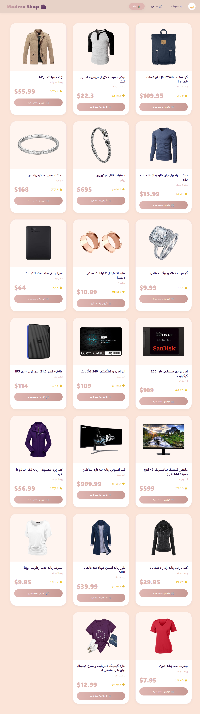
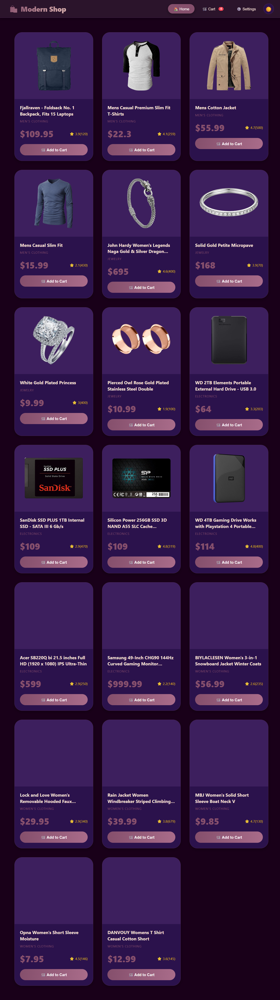
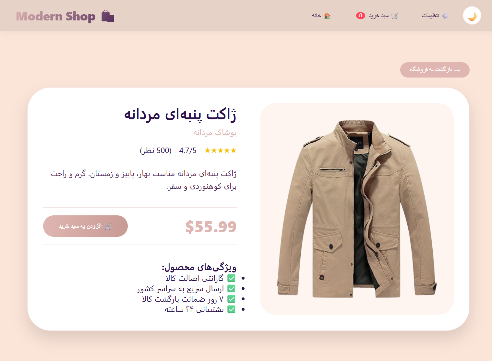
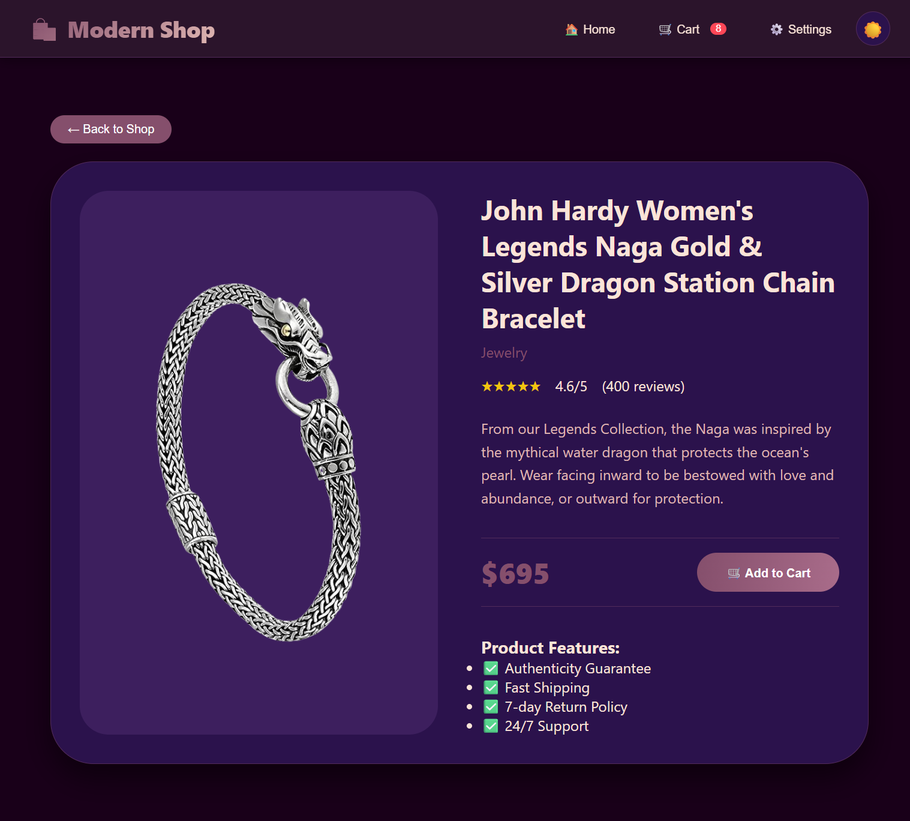
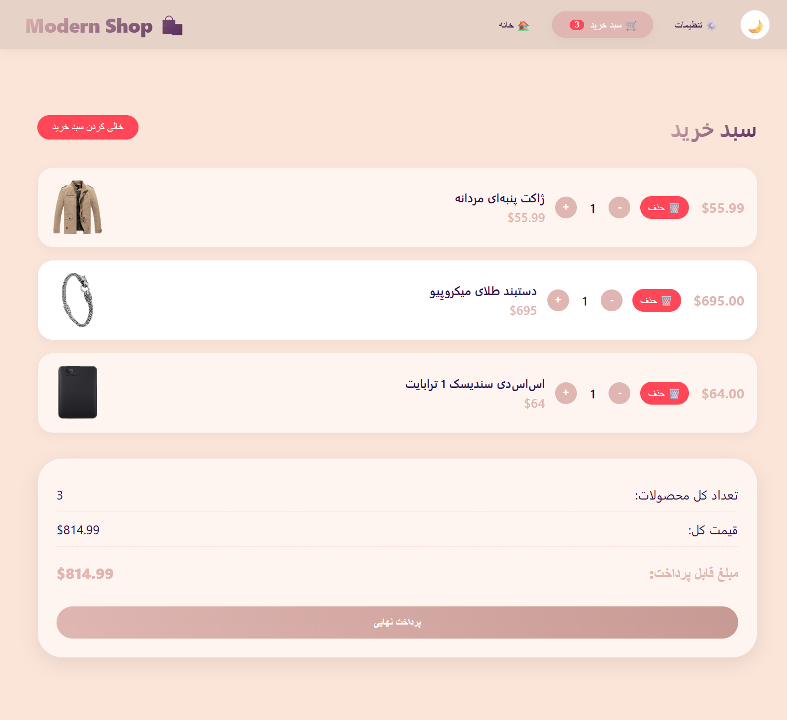
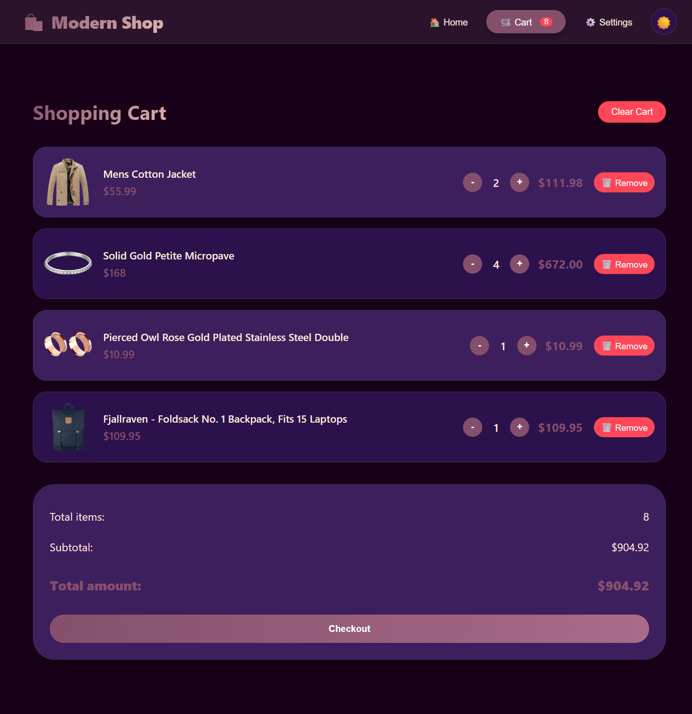
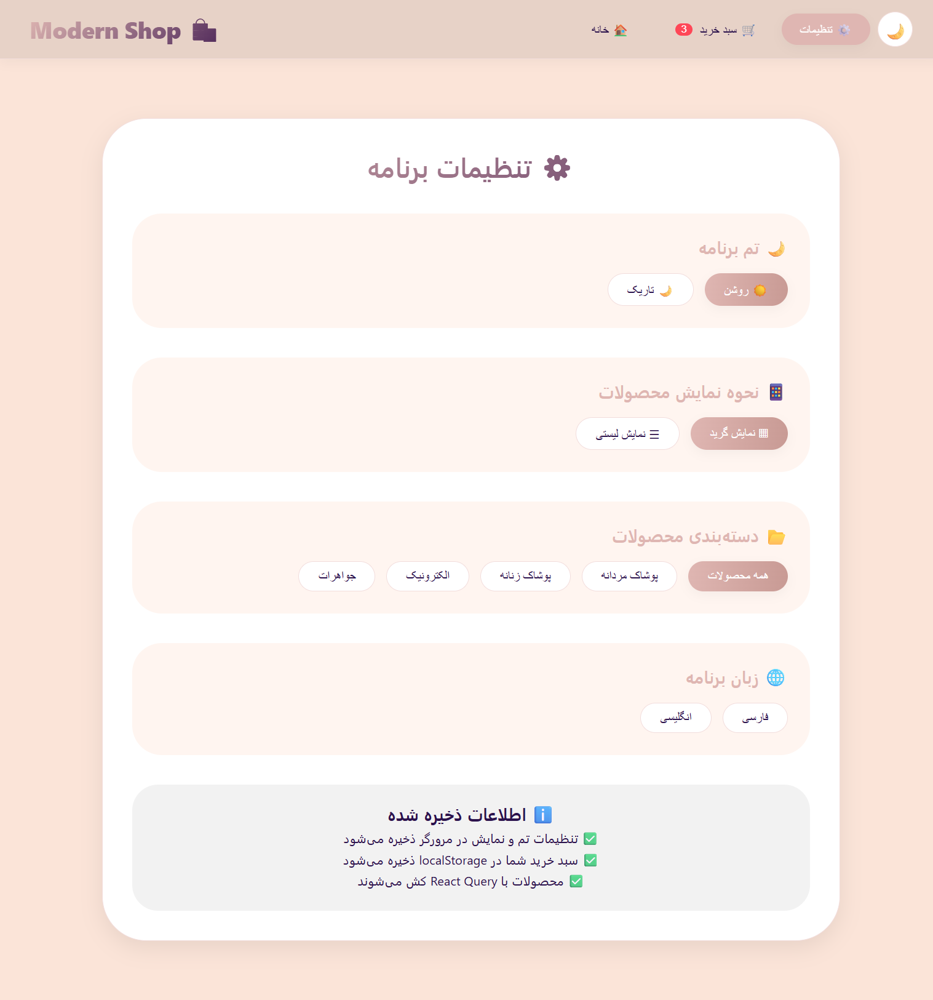
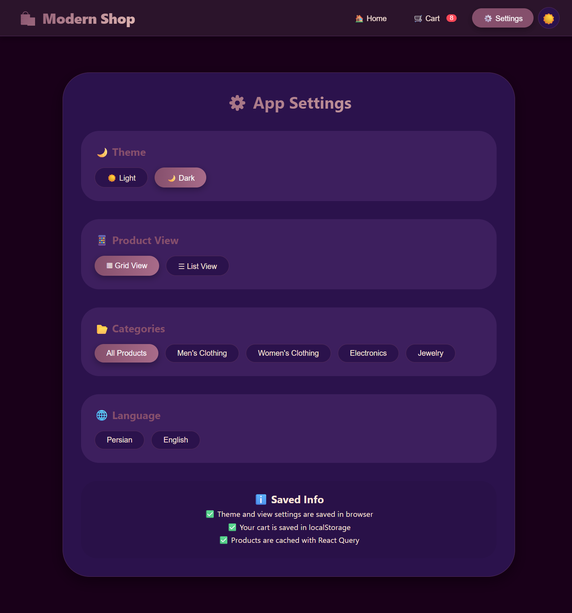

# Product Store App
This React e-commerce app uses Context API + useReducer for theme and layout settings, Redux Toolkit for cart management, and React Query for product fetching/caching. It supports Persian with RTL, full translations, and a responsive modern design.

## ⚙️ Features
- Product listing with React Query
- Product details page
- Shopping cart with Redux Toolkit
- Add / Remove / Increase / Decrease quantity
- Theme system (Context API + useReducer)
- Dark / Light mode
- Settings panel
- Responsive design
- Persian RTL support

## 🛠️ Tech Stack
- React
- Redux Toolkit
- React Query
- Context API
- useReducer
- CSS

## 🚀 How to Run

npm install  
npm run dev

## 📸 Screenshots

---

## 🏠 Home Page

### ☀️ Light Mode

### 🌙 Dark Mode

---

## 📄 Product Details Page

### ☀️ Light Mode

### 🌙 Dark Mode

---

## 🛒 Cart Page

### ☀️ Light Mode

### 🌙 Dark Mode

---

## ⚙️ Settings Page

### ☀️ Light Mode

### 🌙 Dark Mode
